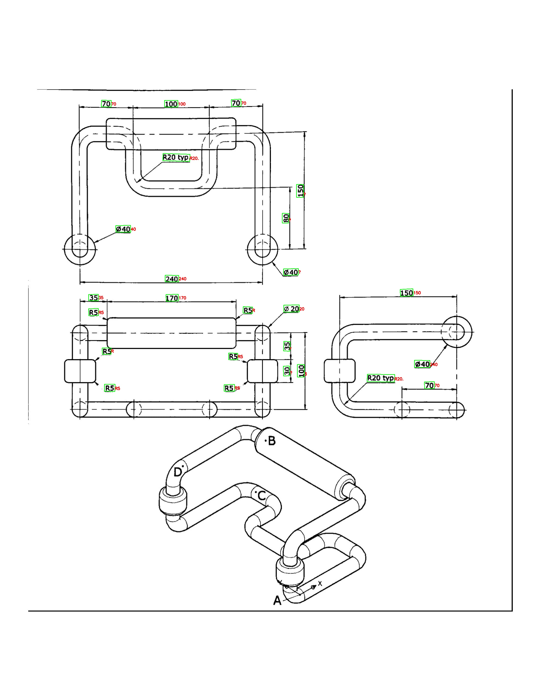

# Technical Drawing OCR Pipeline

Lightweight OCR workflow for technical drawings using YOLO oriented bounding boxes (OBB) and Tesseract.

## What This Project Does 📌

- 🔍 Detects dimension regions from drawing images with an OBB model
- 🔄 Corrects crop orientation before OCR
- 🧹 Applies image preprocessing for better text readability
- 🔠 Extracts dimension text using Tesseract
- 💾 Saves an annotated image and a text report

## Key Features ✨

- 📐 OBB detection for rotated dimension callouts
- 🎯 Filtering by target class (`dimension`)
- 🧭 Rotation-aware crop normalization
- 🖼️ OCR preprocessing (grayscale, upscaling, Otsu threshold)
- ⚙️ Tuned OCR config for technical symbols and numeric text
- 📤 Export of both visual and text results

## Requirements 🧩

- 🐍 Python 3.10+
- 🔤 Tesseract OCR installed on the machine
- 📦 Dependencies from `requirements.txt`

## Setup 🛠️

```bash
pip install -r requirements.txt
```

If Tesseract is not in `PATH`, set it in `testocr.py`:

```python
pytesseract.pytesseract.tesseract_cmd = r"C:\Program Files\Tesseract-OCR\tesseract.exe"
```

Update these values in `testocr.py` if needed:
- Model path (`runs/obb/technical_drawing/weights/best.pt`)
- Input image path used in `detector.analyze(...)`

## Run ▶️

```bash
python testocr.py
```

## Output 📁

- 🖼️ `output/annotated_result.jpg`
- 📝 `output/results.txt`

## Sample Annotated Image 🧪



<br>
<br>

Use the space above to add additional examples or side-by-side comparisons.
